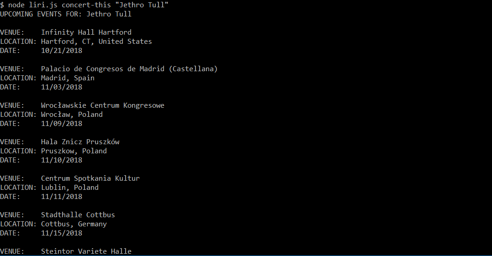
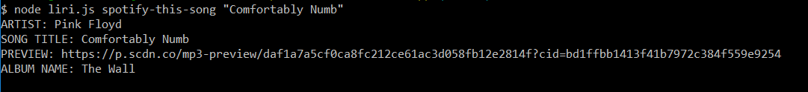
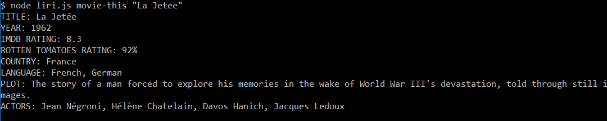
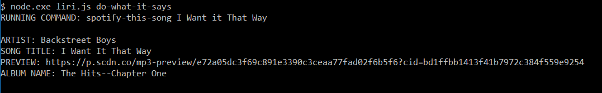

# liri-node-app
LIRI (Language Interpretation and Recognition Interface) - a command-line interface that allows users to access information from various APIs

## Functionality
LIRI can search Bands in Town, Spotify, and OMDB APIs using command-line inputs

## Available Commands
* concert-this [artist name]
* spotify-this-song [song name]
* movie-this [movie name]
* do-what-it-says

## Command Details

### concert-this
`concert-this [artist name]` will use the Bands in Town API to find upcoming events for the given artist.
`[artist name]` must be in quotes if it is not a single word - e.g. `Metallica` or `"Metallica"` is fine, but using `Jethro Tull` instead of `"Jethro Tull"` will lead to unexpected results. If no `[artist name]` is provided, defaults to `"REO Speedwagon"`

All events for the artist returned from the API will be printed to the console. For each event, the veune name, location (City/State/Country), and date will be displayed.

### spotify-this-song

### movie-this

### do-what-it-says

